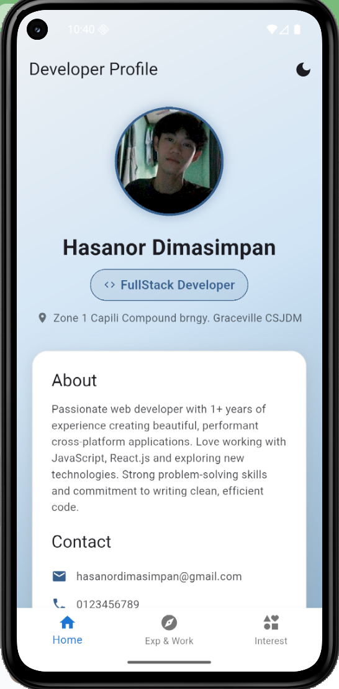
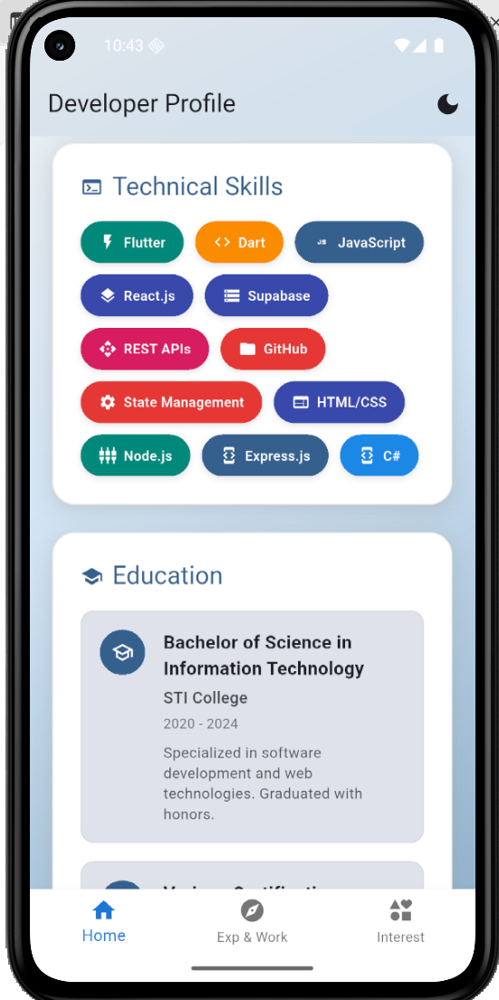
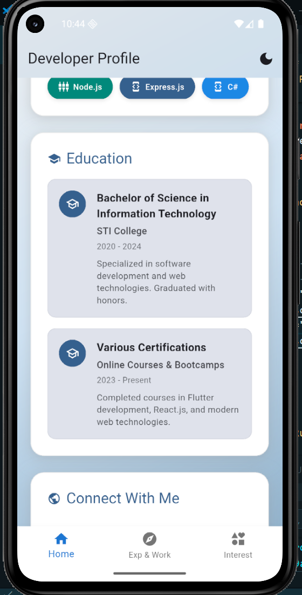
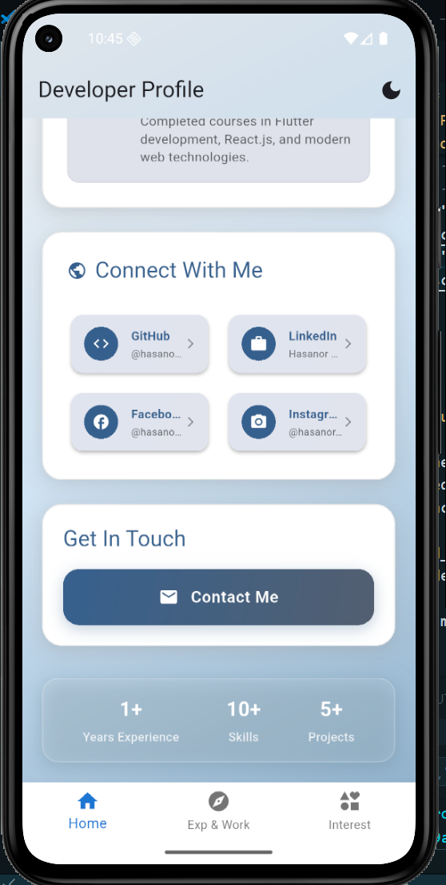
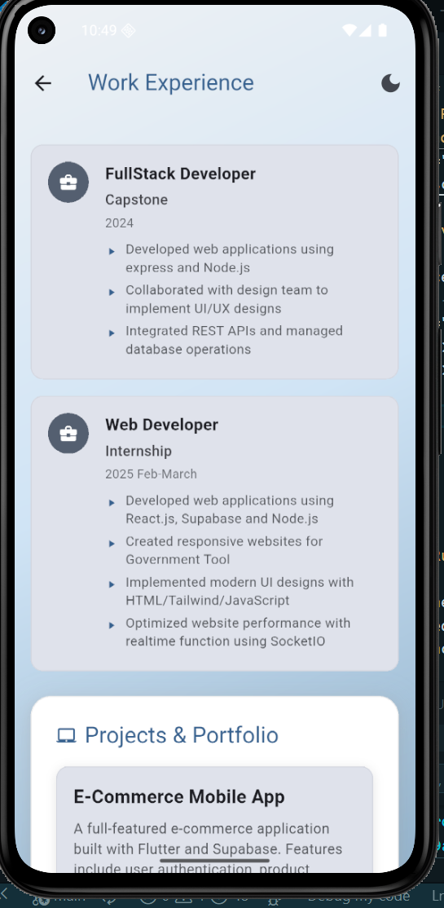
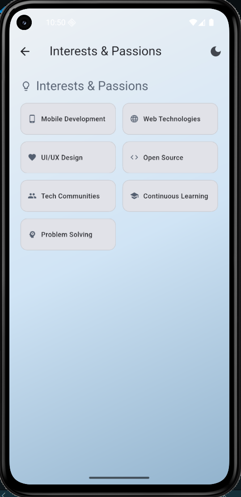
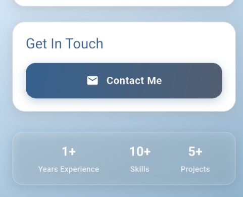
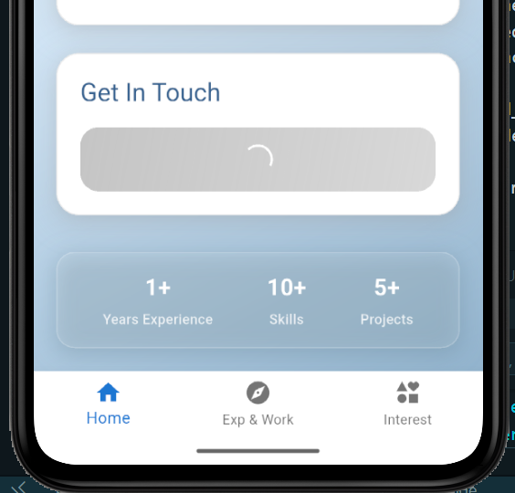
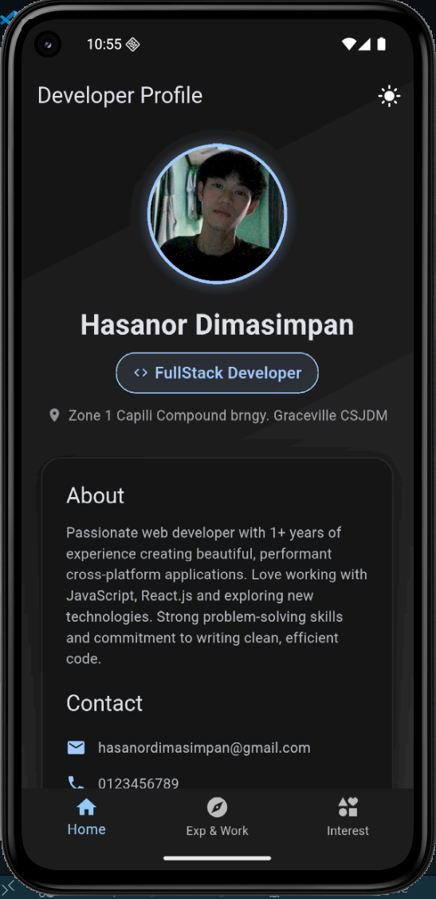
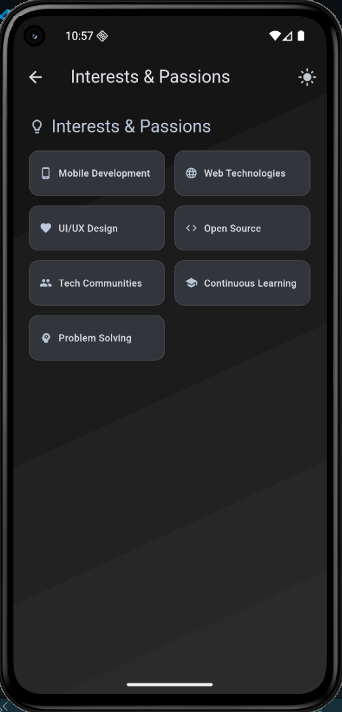

# Personal Profile Page

## Description

A modern Flutter mobile application showcasing my professional profile with interactive elements and smooth animations.

## Features

- **Profile picture display** with animated entrance and circular border
- **Personal information section** showing name, role, and location
- **Contact details** with clickable email button
- **Skills/interests showcase** in organized categories with icons
- **Interactive element** - Theme switcher (dark/light mode) with persistent preferences
- **Bottom navigation** for easy access to different sections
- **Smooth animations** throughout the app for better user experience

## Screenshots

| Profile                                        |                                                |
| ---------------------------------------------- | ---------------------------------------------- |
|   |  |
|  |  |

## When Bottom NavBar Clicked

| Experience Section                             | Interests Section                              |
| ---------------------------------------------- | ---------------------------------------------- |
|  |  |

# Interactive element Image

| Before                                         | After                                          |
| ---------------------------------------------- | ---------------------------------------------- |
|  |  |

## DarkMode

| Light Mode                                     | Dark Mode                                       |
| ---------------------------------------------- | ----------------------------------------------- |
|   |   |
|  |   |
|  |  |

## How to Run

1. Clone the repository
2. Run `flutter pub get`
3. Run `flutter run`

## Challenges Faced

- Implementing smooth navigation between screens while maintaining bottom navigation state
- Creating consistent theming across the entire application
- Managing state for dark/light mode preferences
- Handling image loading errors gracefully
- Layouting the interface it is so confusing

## What I Learned

- State management using Provider pattern
- Navigation and routing in Flutter
- Animation techniques with AnimationController
- Theme customization and persistence
- Responsive UI design principles
- Widget composition and reusability
- How to use the layout design and functions
